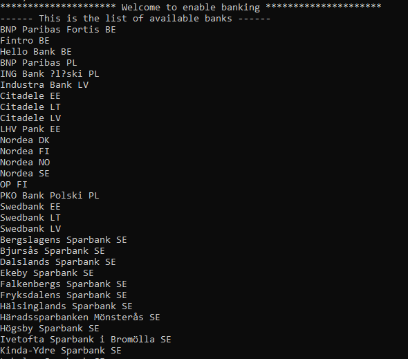
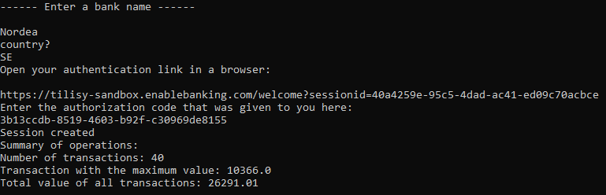

# enableBanking Tilisy API
Spring boot console application using Tilisy API: https://enablebanking.com/docs/tilisy/latest/#tilisy-api  
   -In order to run the application,execute this command on command line: mvn spring-boot:run  
   -A list of available banks will be displayed on the console  
   -Choose one bank, and you will get a redirectUrl that should be run in a browser in order to authenticate and get an authentication code  
   -Enter the code on the command line, and a short summary of the user's bank transactions will be displayed.  

